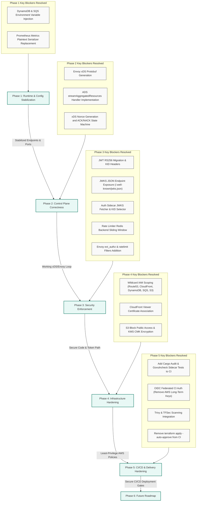

# RUVAMCO — System & Remediation Dependency Graph
**Meer Corporation — Architecture Mapping**
**Version: 1.0 — PLAN ONLY**

---

## 1. Data Path & Control Loop Dependency Graph

The following Mermaid diagram visualizes the active dependencies between RUVAMCO runtime components. The data path (ingress traffic flowing through the Envoy proxy fleet) depends directly on the sidecar services for synchronous request lifecycle validation. The control plane propagates dynamic configurations asynchronously to Envoy via the Aggregated Discovery Service (ADS) gRPC channel.

```mermaid
graph TD
    %% Users and Entry Points
    User(["Client / Consumer"]) -.-> |"HTTPS Ingress (Port 443 / 10000)"| Envoy

    %% Envoy Core Proxy Fleet
    subgraph ProxyNode ["Envoy Proxy Instance (Data Plane Container)"]
        Envoy["Envoy Core Proxy Process"]
        AuthSidecar["Auth Sidecar (Rust / Axum)"]
        RateLimitSidecar["Rate Limit Sidecar (Go)"]
        ObsSidecar["Observability Sidecar (Python)"]

        %% Local Interprocess Communications
        Envoy <--> |"ext_authz (gRPC/HTTP)"| AuthSidecar
        Envoy <--> |"envoy.filters.http.ratelimit"| RateLimitSidecar
        ObsSidecar -.-> |"Scrapes Admin API (Port 9901)"| Envoy
    end

    %% External & Sidecar Dependencies
    AuthSidecar -.-> |"Periodic JWKS Fetch"| JWKSEndpoint["Broker JWKS Endpoint (RS256)"]
    RateLimitSidecar -.-> |"Lua Sliding Window"| RedisCluster[("Redis Cache Cluster")]
    ObsSidecar -.-> |"Metrics Push"| OTELCollector["OpenTelemetry Collector"]

    %% Control Plane Loop
    subgraph ControlPlaneStack ["Control Plane Stack"]
        ControlPlane["xDS Control Plane (gRPC / Port 18000)"]
        ContextManager["Context Manager"]
        S3ContextBucket[("S3 Context Storage")]

        ControlPlane -.-> |"xDS/ADS Stream"| Envoy
        ControlPlane <--> ContextManager
        ContextManager <--> S3ContextBucket
    end

    %% Broker and Worker Orchestration
    subgraph OrchestrationStack ["Provisioning Orchestration Stack"]
        Broker["FastAPI Broker API"]
        DynamoDB[("DynamoDB Instance Table")]
        SQSQueue[("SQS Task Queue")]
        Worker["Async Provisioning Worker"]

        Broker <--> DynamoDB
        Broker -.-> |"Enqueue Task"| SQSQueue
        SQSQueue -.-> |"Dequeue Task"| Worker
        Worker <--> DynamoDB
        Worker -.-> |"Upload Context"| S3ContextBucket
    end

    %% Infrastructure Providers
    subgraph AWSProviders ["AWS Managed Infrastructure"]
        Route53["Route 53 Hosted Zone"]
        CloudFront["CloudFront CDN"]
    end

    Worker -.-> |"Create A/CNAME Record"| Route53
    Worker -.-> |"Provision CDN"| CloudFront

    %% Styling
    style Envoy fill:#4B7BF5,stroke:#1A3C8B,stroke-width:2px,color:#fff
    style AuthSidecar fill:#EC7063,stroke:#78281F,stroke-width:2px,color:#fff
    style RateLimitSidecar fill:#5DADE2,stroke:#1B4F72,stroke-width:2px,color:#fff
    style ObsSidecar fill:#52BE80,stroke:#1E8449,stroke-width:2px,color:#fff
    style ControlPlane fill:#F4D03F,stroke:#7E5109,stroke-width:2px,color:#000
    style Worker fill:#EB984E,stroke:#6E2C00,stroke-width:2px,color:#fff
    style Broker fill:#A569BD,stroke:#4A235A,stroke-width:2px,color:#fff
    style DynamoDB fill:#F5B041,stroke:#7E5109,stroke-width:2px
    style S3ContextBucket fill:#F5B041,stroke:#7E5109,stroke-width:2px
    style SQSQueue fill:#F5B041,stroke:#7E5109,stroke-width:2px
    style RedisCluster fill:#F1948A,stroke:#6E2C00,stroke-width:2px
```

---

## 2. Remediation Phase Dependencies

The implementation plan is structured into six phases. Remediation items must be executed in order, as downstream fixes depend on upstream changes. For example, xDS control plane protocol correctness (Phase 2) cannot be validated if the base environments and endpoints (Phase 1) are not stabilized. Similarly, the JWT RS256 token verification cannot be implemented in the Auth Sidecar (Phase 3) until the Broker exposes the JWKS endpoint (Phase 3).

---

## 3. Code Change Dependency Matrix

To avoid circular dependencies and integration failures during code execution, developers must observe the following sequence:

| Task ID | Action Component | Depends On | Rationale |
|---|---|---|---|
| **P1-T1** | `broker/main.py` endpoint injection | None | Base setup for configuring DynamoDB/SQS URLs from `.env`. |
| **P1-T2** | `worker/main.py` endpoint injection | **P1-T1** | The worker needs matching endpoint parameters to communicate with local DynamoDB and ElasticMQ. |
| **P2-T1** | `scripts/generate_protos.sh` | None | Control plane cannot import generated gRPC classes until protobufs are compiled. |
| **P2-T2** | `control_plane/xds_server.py` ADS implementation | **P2-T1** | The servicer implementation references classes generated by the protobuf compiler. |
| **P2-T3** | `docker-compose.yml` Envoy service update | **P2-T2** | Envoy proxy container will crash on start if it tries to connect to a control plane without ADS. |
| **P3-T1** | `broker/auth.py` RS256 migration | None | Private key RSA pair must be generated to support JWT signing. |
| **P3-T2** | `broker/jwks.py` public key exposure | **P3-T1** | Public key cannot be served via JWKS until RSA keypair generation is complete. |
| **P3-T3** | `sidecars/auth` JWKS integration | **P3-T2** | Auth sidecar will fail startup probes if the broker JWKS endpoint is unreachable or missing. |
| **P3-T4** | `sidecars/ratelimit` Redis integration | None | Go Redis client requires active Redis service block in docker-compose. |
| **P3-T5** | `control_plane/templates` listener changes | **P3-T3**, **P3-T4** | Envoy config template reload will cause proxy traffic drop if sidecars are not listening. |
| **P4-T1** | `worker/provisioners/cdn.py` ACM Cert | None | CloudFront distribution will fail to provision if custom alias lacks certificate. |
| **P4-T2** | `terraform/modules/control-plane` IAM limits | **P1-T1**, **P1-T2** | Scoped IAM roles must match the resources generated by stabilized environments. |
| **P5-T1** | `.github/workflows/ci.yml` matrix update | **P3-T3**, **P3-T4** | CI runner must have Rust (`cargo`) and Go environments configured to compile sidecars. |
| **P5-T2** | `.github/workflows/ci.yml` OIDC setup | **P4-T2** | IAM role for OIDC trust must be configured in AWS console/Terraform before CI migration. |

---
*End of Document. Refer to the [Task List](file:///C:/Users/hashm/.gemini/antigravity-ide/brain/ce3b3b16-c791-45d8-b857-6d8a6391d4a2/task.md) for individual task checklists.*
